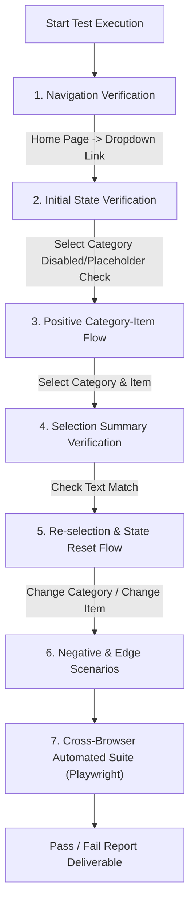

# Master Test Plan: Cascading Dropdown Feature

---

## 1. Test Plan ID
**TP-SQA-DROPDOWN-001**

---

## 2. Project / Feature Name
* **Project Name**: Scripted QA Automation Playground (`https://www.scriptedqa.com/`)
* **Feature Name**: Cascading Dropdown Component (`https://www.scriptedqa.com/dropDown`)

---

## 3. Test Objective
The primary objective of this Test Plan is to define a structured quality assurance strategy for verifying the end-to-end functionality, user experience, input validation, state transitions, and dynamic summary updating of the **Cascading Dropdown** section. 

This test plan ensures that users can navigate seamlessly from the Home page (`/home`) to the Dropdown page (`/dropDown`), select valid category-item combinations, receive accurate dynamic updates in the **Selection Summary**, and experience consistent UI behavior across supported desktop and mobile web browsers.

---

## 4. Scope

### In-Scope:
1. **Navigation & Accessibility**:
   - Visibility and clickability of the "Dropdown" navigation link on the Home page (`/home`).
   - Page routing and DOM initialization of `https://www.scriptedqa.com/dropDown`.
2. **Cascading Dropdown UI & Behavior**:
   - Availability and rendering of the `Select Category` dropdown list (`Fruits`, `Vegetables`, `Beverages`).
   - Disabled state of `Select Item` dropdown when no category is selected (`-- Choose Category --`).
   - Enablement and population of the `Select Item` dropdown upon category selection.
   - Availability of items (including `Coffee`, `Tea`, `Smoothie`, `Fruit Juice` under relevant categories).
3. **Dynamic State Management & Selection Summary**:
   - Display of the **Selection Summary** section at the bottom of the Cascading Dropdown component.
   - Accuracy of the rendered Category and Item values inside the Selection Summary.
   - Real-time updating of the Selection Summary when selections are modified or reset.
   - Repeated selection cycles to ensure memory stability and state persistence.
4. **Cross-Browser & Responsive Design**:
   - Basic functional and layout checks on Chromium, Firefox, and WebKit at Desktop (1280x720) and Viewport Mobile (375x667) resolutions.

---

## 5. Out of Scope
1. **Backend Database & Persistence**: Backend server storage or API database persistence of user selections beyond the active browser DOM session.
2. **Authentication / RBAC**: Security authorization or user role permissions beyond standard authenticated access (`admin` / `Pass@9211`).
3. **Non-Cascading Components**: Independent testing of adjacent components on the `/dropDown` page (such as Single Select or Multi Select dropdowns), except where they share global layout boundaries.
4. **Performance Load / Stress Testing**: High-concurrency server load testing or API stress testing.

---

## 6. Features to be Tested

| Feature ID | Feature Name | Description | Target Component |
| :--- | :--- | :--- | :--- |
| **FEAT-01** | Navigation to Dropdown Page | Accessing `/dropDown` via the Home page navigation menu. | `text=Dropdown` link |
| **FEAT-02** | Category Selection | Render and select `Fruits`, `Vegetables`, or `Beverages`. | `Select Category` dropdown |
| **FEAT-03** | Item Selection | Enablement and selection of items (e.g., `Coffee`, `Tea`, `Smoothie`, `Fruit Juice`). | `Select Item` dropdown |
| **FEAT-04** | Selection Summary Rendering | Real-time display and updates of Category and Item text in the Selection Summary. | `SELECTION SUMMARY` card |
| **FEAT-05** | State Reset & Re-selection | Resetting or changing categories/items and verifying summary synchronization. | Cascading Dropdown Card |

---

## 7. Testing Types

### Core Testing Types Included:
1. **Functional Testing**: Verifies that selecting categories enables items, selecting items updates state, and navigation links route to `/dropDown`.
2. **UI / Visual Testing**: Verifies alignment, font legibility, placeholder text (`-- Choose Category --`, `-- Choose Item --`), disabled state styling (`disabled:cursor-not-allowed`), and visual focus borders.
3. **Positive Testing**: Verifies valid end-to-end user flows (e.g., selecting `Beverages` -> `Coffee` correctly displays `Category: Beverages Item: Coffee` in summary).
4. **Negative Testing**: Verifies incomplete workflows, such as selecting a Category without selecting an Item, or attempting to interact with `Select Item` while disabled.
5. **Edge / Boundary Testing**: Verifies rapid re-selection of categories, switching categories after an item is selected, and clearing choices back to default placeholders.

### Supporting Testing Types Included:
6. **Compatibility Testing**: Verifies functionality across major browser engines (Chromium, Firefox, WebKit/Safari).
7. **Usability Testing**: Ensures clear visual hierarchy, intuitive dropdown labels, and immediate visual feedback when choices are made.
8. **Regression Testing**: Executed via automated Playwright test scripts whenever updates are deployed to the navigation or dropdown components.

### Excluded Testing Types & Justification:
* **Localization / i18n Testing**: Excluded because the application is currently offered exclusively in English.
* **Performance / Load Testing**: Excluded because this is a client-side interactive component with no external high-throughput backend endpoints.

---

## 8. Test Strategy

### Execution Approach:
1. **Exploratory & Manual Verification**: Initial verification of DOM elements, dropdown options, and Selection Summary rendering.
2. **Automated End-to-End Suite**: Implement modular Playwright scripts (`@playwright/test`) covering positive paths, edge cases, and regression scenarios across Chromium, Firefox, and WebKit.
3. **Defect Lifecycle Management**: Any discrepancy in option population or summary text mismatch will be logged with browser console logs, DOM snapshots, and step-by-step reproduction steps.

---

## 9. Test Environment

| Component | Specification |
| :--- | :--- |
| **Application Base URL** | `https://www.scriptedqa.com/` |
| **Target Feature Route** | `https://www.scriptedqa.com/dropDown` |
| **Supported Operating Systems** | Windows 11, macOS, Linux |
| **Supported Browsers** | Google Chrome (Latest), Mozilla Firefox (Latest), Apple Safari / WebKit (Latest) |
| **Test Automation Framework** | Playwright v1.63.0 (`@playwright/test`) with TypeScript |
| **Execution Modes** | Headless (CI/CD pipeline) and Headed (`--headed` for debugging) |

---

## 10. Test Data

| Data ID | Category Value | Available Item Options | Test Scenario Usage |
| :--- | :--- | :--- | :--- |
| **TD-01** | `Fruits` | `Apple`, `Banana`, `Mango`, `Orange`, `Strawberry` | Positive & Re-selection Testing |
| **TD-02** | `Vegetables` | `Carrot`, `Broccoli`, `Cauliflower`, `Eggplant` | Category Change Verification |
| **TD-03** | `Beverages` | `Coffee`, `Tea`, `Smoothie`, `Fruit Juice` | Specified Requirement Validation |
| **TD-04** | `-- Choose Category --` | None (Disables Item Dropdown) | Initial State & Reset Testing |

---

## 11. Entry Criteria
1. Test environment (`https://www.scriptedqa.com/`) is stable and accessible.
2. Valid user credentials (`admin` / `Pass@9211`) are available and functional.
3. Test Plan approved by QA Lead and Product Stakeholders.
4. Playwright automation framework configured in repository (`tests/`).

---

## 12. Exit Criteria
1. 100% of planned test scenarios executed against the target environment.
2. Zero High or Critical severity defects remaining open.
3. All automated Playwright specs (`tests/dropdown.spec.ts`) passing cleanly in CI/CD across Chromium, Firefox, and WebKit.
4. Test Execution Summary Report published and signed off.

---

## 13. Roles and Responsibilities

| Role | Responsibilities |
| :--- | :--- |
| **Senior QA Engineer** | Authors Test Plan, designs test scenarios, builds Playwright automation scripts, executes tests, and logs defects. |
| **Frontend Developer** | Resolves UI bugs, ensures dropdown accessibility standards, and maintains DOM element selectors. |
| **Product Owner / QA Lead** | Approves Test Plan, resolves requirement clarifications, and signs off on exit criteria. |

---

## 14. Risks and Mitigation

| Risk ID | Identified Risk | Impact | Severity | Mitigation Strategy |
| :--- | :--- | :--- | :--- | :--- |
| **RKS-01** | Flaky selector resolution due to dynamic React rendering | High | Medium | Use robust text-based locators (`page.locator('div:has-text("Cascading Dropdown")')`) instead of fragile XPaths. |
| **RKS-02** | Unstated mapping between categories and item lists | Medium | Low | Clearly document unconfirmed mappings as Requirement Clarifications and verify options dynamically. |
| **RKS-03** | Selection Summary out of sync upon rapid category switching | High | High | Add explicit verification steps for intermediate DOM states during rapid option selection. |

---

## 15. Test Deliverables
1. **Master Test Plan Document**: `specs/cascading-dropdown-test-plan.md`
2. **Automated Playwright Test Suite**: `tests/dropdown.spec.ts`
3. **Execution Results & Trace Logs**: `test-results/` (Playwright HTML Report)
4. **Requirement Clarifications & Defect Log**: Summary embedded in test documentation.

---

## 16. Assumptions and Dependencies

### Assumptions:
1. **Initial Unselected State**: The page initially loads with `Select Category` set to `-- Choose Category --` and `Select Item` disabled.
2. **Category Selection Trigger**: Selecting a category is required to enable the `Select Item` dropdown.
3. **Summary Visibility**: The Selection Summary element is rendered on page load and dynamically updates text nodes upon user selection.
4. **Category-Item Mapping**: Unless specified by product design, items available under a category are determined by the application backend/config.

### Dependencies:
1. Availability and network uptime of `https://www.scriptedqa.com/`.
2. Home page navigation link (`text=Dropdown`) remaining operational.

---

## 17. Detailed Test Scenarios & Cases

### Category 1: Navigation & Initial State (UI & Functional)

#### TC-DD-01: Verify Dropdown Section Navigation from Home Page
* **Type**: Functional / UI
* **Steps**:
  1. Navigate to `https://www.scriptedqa.com/home`.
  2. Verify that the `Dropdown` navigation link is visible and clickable.
  3. Click `Dropdown`.
* **Expected Result**: User is routed to `https://www.scriptedqa.com/dropDown`.

#### TC-DD-02: Verify Initial Render State of Cascading Dropdown
* **Type**: UI / Boundary
* **Steps**:
  1. Navigate to `https://www.scriptedqa.com/dropDown`.
  2. Inspect `Cascading Dropdown` card.
* **Expected Result**:
  - `Select Category` defaults to `-- Choose Category --`.
  - `Select Item` is **Disabled** displaying `Select a category first`.
  - Selection Summary renders default text (e.g., `Category: None Item: None` or empty placeholders).

---

### Category 2: Positive Core Functional Scenarios

#### TC-DD-03: Category Selection and Item Dropdown Enablement
* **Type**: Positive / Functional
* **Steps**:
  1. Open `Select Category` dropdown.
  2. Verify options `Fruits`, `Vegetables`, and `Beverages` are present.
  3. Select `Beverages`.
* **Expected Result**:
  - Category updates to `Beverages`.
  - `Select Item` dropdown becomes **Enabled**.
  - `Select Item` populates options including `Coffee`, `Tea`, `Smoothie`, `Fruit Juice`.

#### TC-DD-04: Complete Selection & Selection Summary Accuracy (Beverages + Coffee)
* **Type**: Positive / Functional
* **Steps**:
  1. Select `Beverages` in `Select Category`.
  2. Select `Coffee` in `Select Item`.
* **Expected Result**:
  - Selection Summary updates immediately.
  - Summary text displays: `Category: Beverages Item: Coffee`.

#### TC-DD-05: Category & Item Selection Combination (Beverages + Fruit Juice)
* **Type**: Positive / Functional
* **Steps**:
  1. Select `Beverages` in `Select Category`.
  2. Select `Fruit Juice` in `Select Item`.
* **Expected Result**:
  - Selection Summary displays: `Category: Beverages Item: Fruit Juice`.

#### TC-DD-06: Category & Item Selection Combination (Fruits + Apple)
* **Type**: Positive / Functional
* **Steps**:
  1. Select `Fruits` in `Select Category`.
  2. Select `Apple` in `Select Item`.
* **Expected Result**:
  - `Select Item` dropdown enables and displays Fruit items (`Apple`, `Banana`, `Mango`, `Orange`, `Strawberry`).
  - Selection Summary displays: `Category: Fruits Item: Apple`.

---

### Category 3: Edge & State Modification Scenarios

#### TC-DD-07: Switching Category After Item Selection
* **Type**: Edge / State Transition
* **Steps**:
  1. Select `Beverages` -> `Coffee`. Confirm summary: `Category: Beverages Item: Coffee`.
  2. Change `Select Category` to `Fruits`.
* **Expected Result**:
  - `Select Item` options update to Fruit items.
  - Selected item resets to default `-- Choose Item --`.
  - Selection Summary updates to reflect `Category: Fruits` and clears or resets the Item value.

#### TC-DD-08: Resetting Category Back to Default Placeholder
* **Type**: Edge / Boundary
* **Steps**:
  1. Select `Beverages` -> `Tea`.
  2. Change `Select Category` back to `-- Choose Category --`.
* **Expected Result**:
  - `Select Item` dropdown returns to **Disabled** state (`Select a category first`).
  - Selection Summary resets Category and Item fields.

#### TC-DD-09: Repeated Rapid Selections (UI Stability)
* **Type**: Usability / Boundary
* **Steps**:
  1. Rapidly alternate category selections between `Fruits`, `Vegetables`, and `Beverages` 5 times in succession.
* **Expected Result**: UI remains responsive, options populate without DOM flickering or console script errors.

---

## 18. Requirement Clarifications (QA Confirmation Items)

> [!IMPORTANT]
> As per QA best practices, the following behaviors are not explicitly defined in the provided prompt specification and must be confirmed with the Product Owner / Developer:

1. **Item Reset Behavior on Category Change**:
   - *Question*: When a user changes the Category (e.g. from `Beverages` to `Fruits`) after an Item (`Coffee`) was already selected, should the Item dropdown automatically reset to `-- Choose Item --`, or should it attempt to retain a matching value if one exists?
   - *Assumed Behavior*: Item dropdown resets to `-- Choose Item --` and Selection Summary clears the Item value.

2. **Item-Category Exclusivity**:
   - *Question*: Are items strictly bound to specific categories (e.g. `Coffee` only under `Beverages`), or can items be shared across multiple categories depending on backend configuration?
   - *Assumed Behavior*: The UI dynamically filters items per category (e.g., `Coffee`, `Tea`, `Smoothie`, `Fruit Juice` populate under `Beverages`; `Apple`, `Banana`, `Mango` populate under `Fruits`).

3. **Incomplete Selection Summary State**:
   - *Question*: When a Category is selected but no Item has been chosen yet, what exact text should the Selection Summary display for the Item field (e.g., `Item: None`, `Item: --`, or blank)?
   - *Assumed Behavior*: Displays `Category: <SelectedCategory>` with Item unpopulated or showing `None`.

4. **Persisted State on Tab Re-navigation**:
   - *Question*: If the user navigates away to another page (e.g. `Shopping`) and returns to `Dropdown`, should the Cascading Dropdown retain previous selections or reset to initial blank state?
   - *Assumed Behavior*: Component resets to initial unselected state on route re-entry.

---

## 19. Key Risks

1. **Cascading State Disconnect (High Risk)**:
   - *Risk*: `Select Item` fails to unlock or update its option list when `Select Category` changes, causing users to be stuck with disabled or invalid item choices.
   - *Impact*: Critical functional blocker for the cascading feature.

2. **Selection Summary Out-of-Sync (Medium Risk)**:
   - *Risk*: Selection Summary text fails to re-render in real-time when a user changes an item or switches categories rapidly.
   - *Impact*: Visual mismatch between user selection and displayed confirmation text.

3. **DOM Selector Ambiguity in Automated Testing (Low Risk)**:
   - *Risk*: Multiple dropdown components exist on the `/dropDown` page (Single Select, Multi Select, Cascading Dropdown), which can lead to strict-mode locator collisions in Playwright tests if not scoped to the Cascading Dropdown container.
   - *Impact*: Test automation flakiness if generic `select` locators are used.

---

## 20. Recommended Test Coverage

| Test Area | Recommended Coverage % | Primary Execution Mode |
| :--- | :--- | :--- |
| **Navigation & Page Routing** | 100% | Automated (Playwright) |
| **Category Option Availability** | 100% | Automated (Playwright) |
| **Item Option Availability per Category** | 100% | Automated (Playwright) |
| **Selection Summary Accuracy** | 100% | Automated (Playwright) |
| **State Reset & Boundary Switching** | 100% | Automated (Playwright) |
| **Cross-Browser (Chrome/Firefox/Safari)** | 100% | Automated (Playwright Multi-Browser Runner) |
| **Responsive Mobile Layout (Viewport 375x667)** | 80% | Automated Visual / Manual Check |

